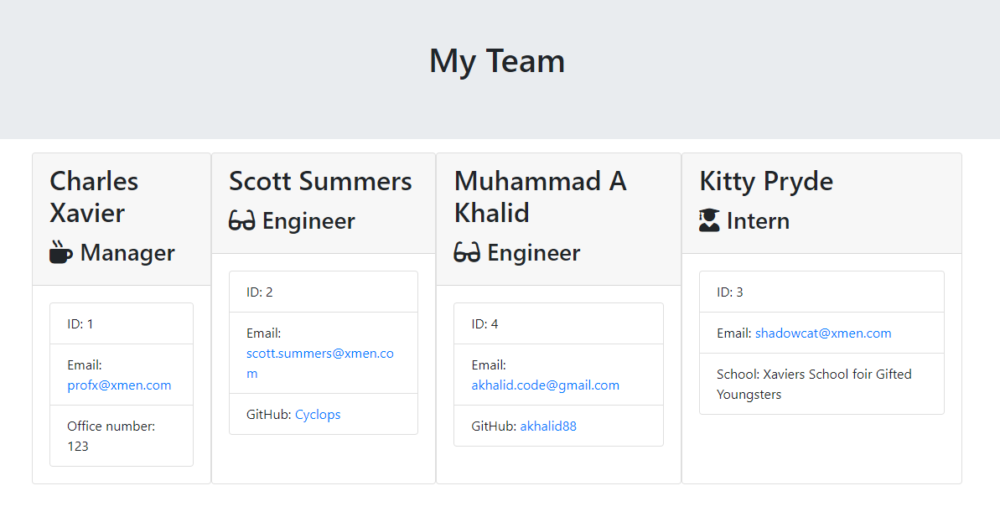

# Template Engine  [](https://opensource.org/licenses/MIT) 
###### This readme has been procedurally generated 

-----------------------
## Table of Contents
1. [Description](#description)
2. [Deployed link](#deployed-link)
3. [Installation](#installation)
4. [Usage](#usage)
5. [Code snippets](#code-snippets)
6. [Licenses](#licenses)
7. [Contributing](#contributing)
8. [Tests](#tests)
9. [Questions](#questions)

-----------------------
## Description
A Node.js command-line application that generates a Team Profile HTML page with links to team members' emails and other relevant data.



-----------------------
## Deployed link
No deployed link. Download or fork repo.

-----------------------
## Installation
To install dependencies run the following command:
```
npm install
```

-----------------------
## Usage
To use this repo you will need a working knowledge of Javascript and Node.js. 

To run this tool use the following command. This will generate a markdown file in the root folder with the name of 'READMETOO.md

```
node app.js
```

This application makes use of the following Node packages
- fs
- inquirer
- jest
- path

-----------------------
## Code snippets

After prompting the user for a en employees information, the user is given an option to add more employees, the `employeeMenu()` function. The response of this prompt is passed to a switch statement where it then calls the appropriate functions

```
switch (choice.teamMember) {
  case "Engineer":
    requestEngineerInfo();
    break;
  case "Intern":
    requestInternInfo()
    break;
  case "Create Super Team":
    console.log("Compiling Team Roster...");
    generateHTML();
    break;
  default:
    console.log("Invalid choice!");
    break;
}
```

Once the user has finished entering in additional employees and selects the 'Create Super Team" option from the menu, the application will run the generateHTML function. 

It first checks to see id the output directory exists by checking `fs.existsSync(OUTPUT_DIR)`. If it does not exist it will create it using `fs.mkdirSync(OUTPUT_DIR)`. Then finally it will write the data created by `render(employees)` to the output path.

```
function generateHTML() {
	if (!fs.existsSync(OUTPUT_DIR)) {
		console.log("HERE");
		fs.mkdirSync(OUTPUT_DIR);
	}
	fs.writeFile(outputPath, render(employees), function (err) {
		if (err) {
			throw err;
		}
	})
}
```

-----------------------
## Licenses
This project uses a [MIT License](https://opensource.org/licenses/MIT). See link for further information.

-----------------------
## Contributing
If you would like to contribute, you will need to know Javascript Classes and Node.js.

-----------------------
## Tests
To run tests run the following command:
```
npm run test
```

-----------------------
## Questions
Created by Muhammad A Khalid

If you have any questions you can reach me at the following email: [akhalid.code@gmail.com](mailto:akhalid.code@gmail.com)

Follow my other work at GitHub: https://github.com/akhalid88/
